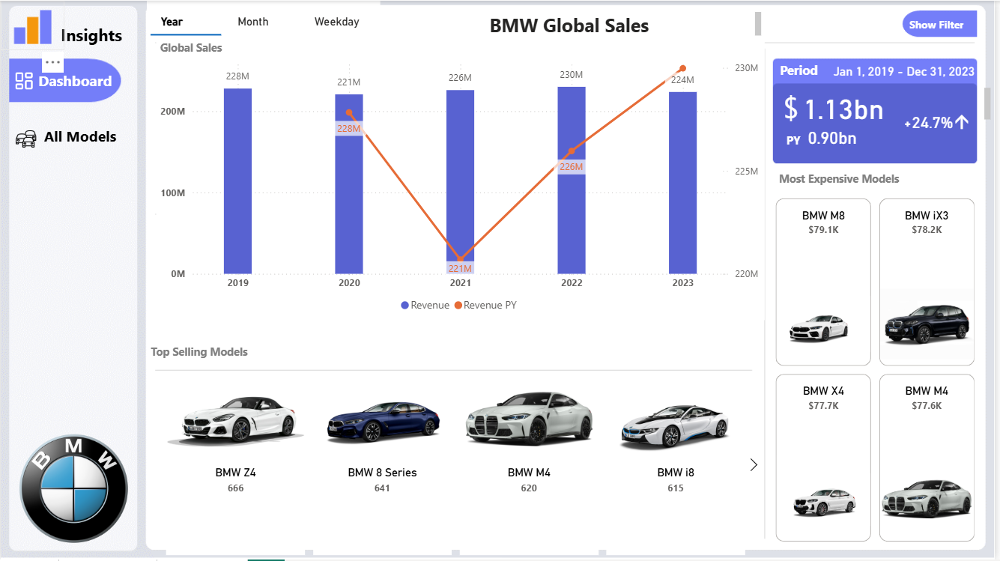
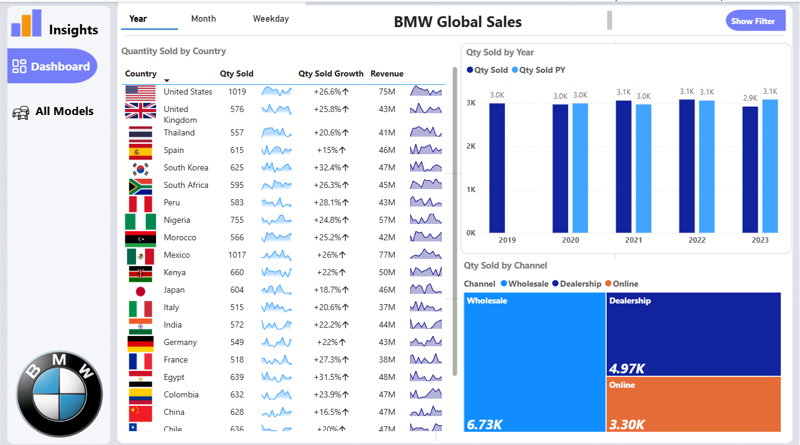
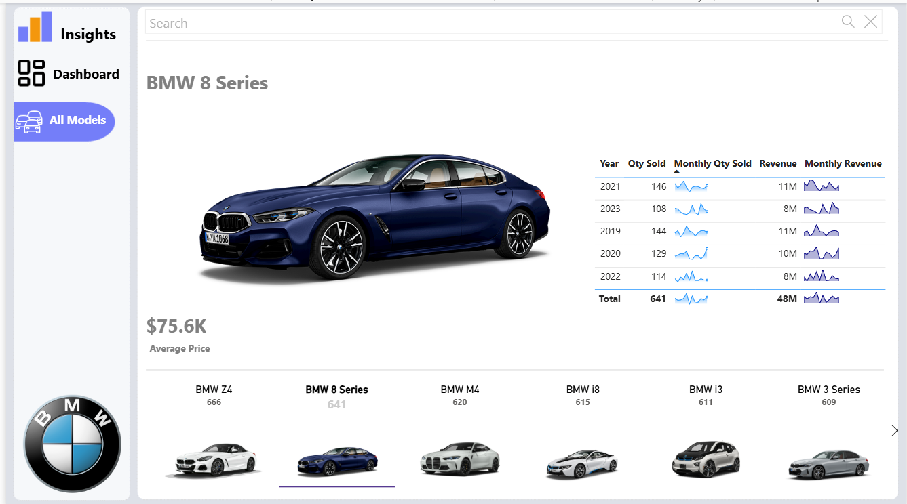

# 🚘 BMW Global Sales Interactive Dashboard  

## 📖 Project Overview  
This project presents an **interactive Power BI dashboard** designed to analyze **BMW’s global sales performance**. The dashboard provides insights into revenue, sales volume, and pricing trends across different regions, countries, and time periods.  

The goal of this project was to demonstrate how **data preprocessing, DAX measures, and interactive visuals** can support business decision-making in a global sales context.  

---

## 🔧 Tools & Technologies  
- **Power BI** – Data modeling, DAX, and dashboard creation  
- **Power Query** – Data cleaning, preprocessing, and transformation  
- **Excel / CSV Dataset** – Source data containing sales transactions (date, year, model, quantity, revenue, region, country, channel)  

---

## 📊 Key Features  
- **Data Preprocessing:**  
  - Cleaned missing dates and duplicate records.  
  - Created a **fact table** and multiple **dimension tables** (Model, Country, Channel).  
  - Established relationships between fact and dimension tables for accurate analysis.  

- **DAX Measures:**  
  - Calculated **total revenue, YoY revenue growth, average sales price, and total quantity sold**.  
  - Built comparative metrics to evaluate performance across different time periods.  

- **Interactive Dashboard:**  
  - Multiple visualization types (line charts, bar charts, donut charts).  
  - **Slicers and filters** for time (day, month, year), region, and product model.  
  - Highlights **top-performing countries, models, and sales channels**.  

---

## 📈 Business Insights  
- Identified **regional sales trends** and revenue contributions by geography.  
- Compared **YoY revenue performance** to measure growth or decline.  
- Revealed **top-selling models and countries**, supporting inventory and marketing strategies.  
- Enabled stakeholders to explore sales data interactively for faster decision-making.  

---

## 🎯 Learning Outcomes  
- Strengthened skills in **data modeling, DAX, and visualization** in Power BI.  
- Applied best practices for **business intelligence and KPI reporting**.  
- Demonstrated ability to turn raw transactional data into **strategic business insights**.  

---

## 🖼️ Dashboard Preview  

